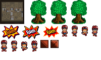

# atlast

*What to make something like THIS:*



*Out of a bunch of separate image files? Now you can!*

Atlast is a texture atlas generator for sprite sheets. This simple program only needs to be configured once per project, and will remember your outputs and configuration - though you will need to reconfigure when switching projects. It will take a as many images as you want and composite them all into one atlas .png file, alongside a JSON file that holds the coordinates of each image so it can be loaded very easily into a game.

The purpose of atlast is to be simple to use and easy to understand. Unfortunately, atlast is **not** for image-processing - it is for creating a texture atlas. To create images that work well with atlast, I recommend [Piskel](https://www.piskelapp.com/), but there are plenty of other free pixel-art programs out there. Atlast was created specifically with WebGL in mind, but these sprite sheets can definitely be used by a 2D canvas context or another program/framework entirely as long as it is able to read atlast's output JSON or JS file.

## Usage

Install atlast globally by using the follow command: ```npm install -g atlast```. **You must install globally. Otherwise, it'll do nothing.**

Use atlast with the following command: ```atlast```. If your configuration hasn't been set, it will ask for any unset values. Otherwise it will remember your last used configuration.

If you'd like to change the configuration after it's been set, use ```atlast config```.

You can change individual configuration values with ```atlast set <key> <value>```, or you can navigate to `atlastconfig.json` to change them manually. A list of keys can be found below.

When compiling your atlas, it is important that your root image directory follows the proper structure:
* Individual files in the root will be loaded as sprites that have only one image. The name of the sprite (that you'll use to reference the sprite in your game/program) will be the file's name.
* Folders in the root will be scanned for images, which will be loaded as one sprite with multiple images. The name of the sprite will be the folder's name.
  * All the image files of one sprite need to be the same dimensions.
  * The filenames don't have an effect on how they're exported or arranged on the atlast, but they DO have an effect on the order they are loaded. As such, the filenames of each image should be ordered properly. Example: `image00.png`, `image01.png`, `image02.png`, etc... This depends on how your operating system sorts the files. Be careful with sprites with over 10 images, because numbering may cause the frames to be compiled in the wrong spots... For example, if you add a tenth image as `image10.png`, it'll come before `image2.png`.
* Any deeper subfolders and files that are not .png format will be ignored.

## How It Works

Atlast works by scanning all the files and subfolders in a directory, and composites the sprites all into one texture atlas using [jimp](https://www.npmjs.com/package/jimp). It also exports a file (either JSON or JS) on atlas compiling, which holds an array of objects. This should then be loaded in by your implementation. Each object in the array can correspond with a sprite, holding information like its name, width, height, and an array of image coordinates that directly correspond with the atlas. Recompiling an atlas will most likely change the coordinates of every image, depending on your changes. Larger images (in terms of pixel area) are composited first, leaving extra space for smaller images. Images are not placed on top of one another by checking a placement grid. Rather than checking every pixel, it'll check along a grid size to see if any sprite occupies within that space. Larger placement grid sizes will make it compile faster, while smaller grid sizes will compile slower but use space more efficiently.

## Implementation

The way you implement an atlast atlas depends entirely on the structure of your program, and it is up to you. Regardless of your decision, you need to store sprites based on the output file, and have some function to draw specific parts of a loaded texture. This example uses an exported JS file, which stores the export into the global, ```ATLAST```. Atlast may also export a JSON file instead.

```javascript
const texture = loadTexture(`output.png`); // Specific to your implementation - 2D vs. WebGL

function drawSprite(index,x,y,image) {

    image = Math.max(0, Math.min(Math.floor(image), ATLAST[index].images.length));

    /*  Like above, you have to create the following method: drawTexture(...)
        It should be able to draw just a portion of the texture atlas.
        Its where you'd apply a transformation matrix and set your shader's texCoords, based on these arguments.
        
        Or, if you're using a 2D Canvas context, this could be a trivial ctx.drawImage(...) call.*/

    drawTexture(texture, x, y,
        ATLAST[index].images[image].x, ATLAST[index].images[image].y,
        ATLAST[index].width, ATLAST[index].height);
}

//  ...

/*  You'll need your own system to index sprites.
    It should be easy to just iterate the ATLAST object and record sprites from there.
    Sprite objects remember the name of the image files/folders they were compiled from,
    so you can use the image file or folder names to refer to specific sprites in your code. */

let spriteIndex = 8; // You'll need your own system to index your loaded sprites.
let frame = 0;
function main() {

    // ...

    // Draw a sprite
    drawSprite(spriteIndex,16,16,frame);
    frame++;

    // Loop the sprite
    if (frame >= ATLAST[spriteIndex].images.length) {
        frame = 0;
    }

    // ...

    requestAnimationFrame(main);
}
```

## Configuration

Here is a more in-depth explanation of what each configurable value (inside `atlastconfig.json`) actually does:

* **Root Image Directory** ```directory```: The base folder which should be scanned for all images. All images inside this folder are compiled into your atlas.
* **Atlas Width** ```atlasWidth```: The width of the final image. Powers of 2 work best for WebGL. **This must be divisible by your placement grid width.**
* **Atlas Height** ```atlasHeight```: The height of the final image. Powers of 2 work best for WebGL. **This must be divisible by your placement grid height.**
* **Placement Grid Width** ```sepW```: How far apart to place images horizontally. Higher values allow for better performance.
* **Placement Grid Height** ```sepH```: How far apart to place images vertically. Higher values allow for better performance.
* **Vertical Placement** ```verticalPlacement```: If true, images will be placed in vertical stripes before being placed horizontally.
* **Output Image Name** ```outputImageName```: The absolute directory+filename of the final image to output. *This should NOT be inside the root image directory!* This should ideally go directly into your development environment.
* **Output JSON Name** ```outputJSONName```: The absolute directory+filename of the final JSON file to output. Like the image name, this should ideally go directly into your development environment.
* **Output as JavaScript** ```outputAsJS```: If true, the output JSON file will instead be a .js file. The object is loaded as a const ATLAST, so you don't need to use an HTTP request for your JSON object when testing locally - You instead only need to include this JS file as a script in your HTML.

## At last, the end!

I hope this all makes sense. Don't hesitate to reach out to me with any questions/concerns/feedback!
